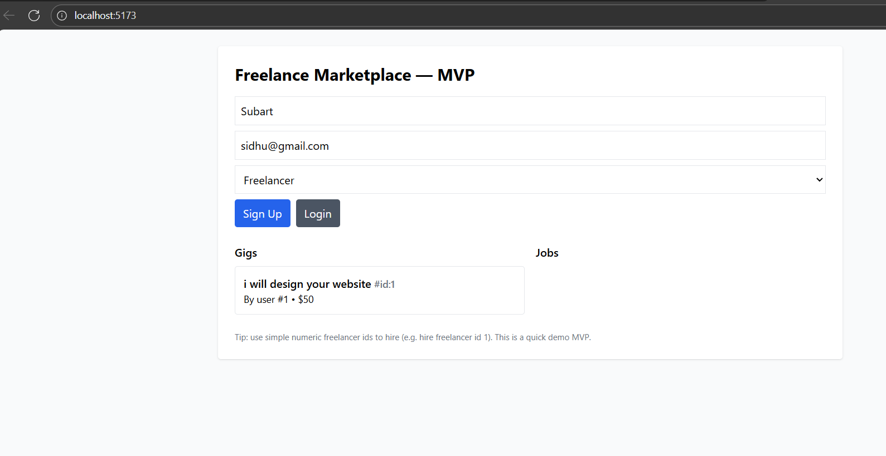
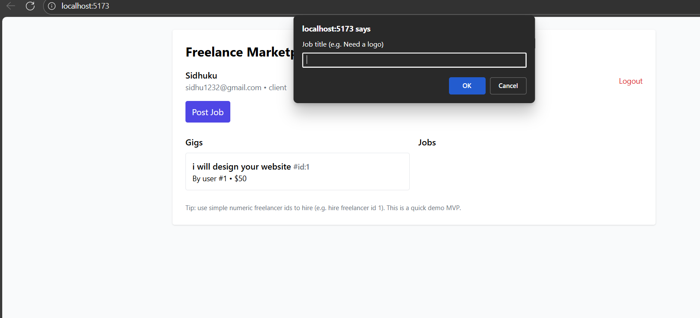
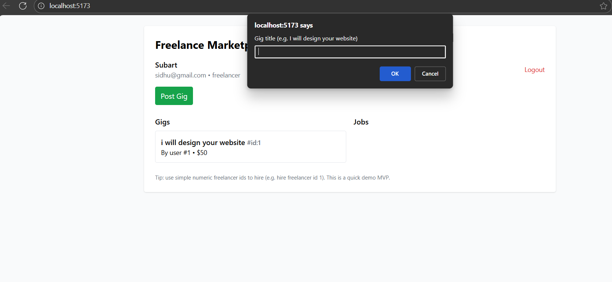

->Freelance Marketplace — MVP

#A lightweight demo of a freelance marketplace platform where clients can post jobs and freelancers can offer gigs. This is a minimal viable product (MVP) version built for learning and experimentation purposes.

📌 Overview:-

This project demonstrates a simple freelance marketplace concept:

Users can sign up either as a client or a freelancer.

Freelancers can create gigs (services they offer).

Clients can browse gigs and post jobs.

All data is stored .

It’s built with a focus on simplicity, so the setup and execution are quick.

🛠️ Technologies Used

Frontend: React + Vite

Styling: TailwindCSS

Backend: Node.js + Express (in-memory storage)

Language: JavaScript (ES6+)

⚙️ Setup Guide

Follow these steps to run the project locally:

1. Clone the Repository
cd freelance-marketplace-mvp

2. Install Dependencies

For both client and server:

# Install frontend dependencies
cd client
npm install

# Install backend dependencies
cd ../server
npm install

3. Run the App

Start both frontend and backend:

# Start backend
cd server
npm start

# Start frontend
cd ../client
npm run dev

Visit the app at:
👉 http://localhost:5173

📸 Screenshots

### Signup Page

### Post Job as Client

### Post Gig as Freelancer

🚀 Future Improvements

Add authentication with JWT

Connect to a database (MongoDB / PostgreSQL)

Implement payments and reviews system
